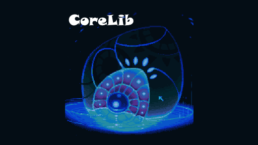

# Core Library <small>{{versionLabel}}</small>
!> CoreLib 4.x is currently in development, and is not available at this time. Please go back to 3.x if you are looking for the latest CoreLib documentation.
If want to see what we have in store for CoreLib 4.x, feel free to look around!

> A modding library for Core Keeper that provides features that makes modding Core Keeper easier.

!> **WARNING:** _Version 4.0.0_ may contain breaking changes. Please raise any bugs reports on [GitHub](https://github.com/CoreKeeperMods/CoreLib/issues).

?> Before proceeding please be sure to read and follow the [guides](https://mod.io/g/corekeeper/r) on mod.io. They may not be perfect, but they will give you an idea and baseline for this.

## Mod Features
- Custom items, blocks, enemies, NPC, etc.
- Easier access to Rewired input system, localization
- Custom chat commands
- Scriptable Objects/Components for Unity Mod Creation
- And much more!

## Mod.io Link
- [CoreLib](https://mod.io/g/corekeeper/m/core-lib ':class=specialLink')