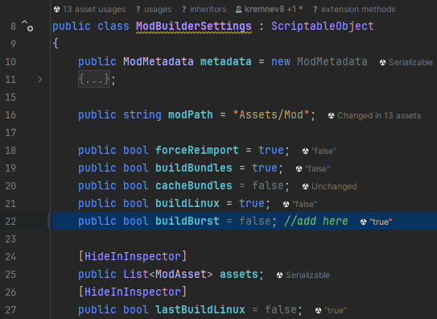

# How to Build Burst Files

> The `CoreLibPackage` allows for burst files to be created.
> The burst files are created on installation of the Mod.
> Though this requires a bit of editing.

## Instructions
Find File: `Assets/ModSDK/SDK/Editor/ModBuilderSettings.cs`

<!-- tabs:start -->

<!-- tab:Line -->

> Add this to line 22 just after the field `buildLinux`:
```cs
public bool buildBurst = false;
```

<!-- tab:ModBuilderSettings.cs -->

?> The `ModBuilderSettings.cs` file should end up like this.



<!-- tabs:end -->

## Done
Now you're good to go.

To build the code, make sure the `Build Burst` checkbox is checked. Also, much like the `Build Bundles` checkbox, `Build Burst` builds the Windows.dll while the `Build Linux` builds the Linux.dll.

Install your mod like usual via the `Mod SDK Window` and the burst files will be added in automatically.


