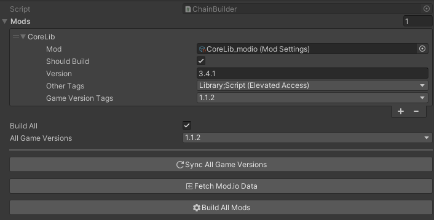

# Chain Builder

## Properties

<!-- tabs: start -->
<!-- tab: ChainBuilder Class -->
| Name              | Type        | Display  | Desc                                               |
|:------------------|:------------|----------|----------------------------------------------------|
| Mods              | ModState[ ] | List     | The list of mods in your project                   |
| Build All         | Boolean     | Checkbox | Build all mods in your Project                     |
| All Game Versions | String      | Dropdown | String list of game versions used to sync all mods |

<!-- tab: ModState Class -->
| Name          | Type        | Display       | Desc                                                                  |
|:--------------|:------------|---------------|-----------------------------------------------------------------------|
| Mod           | Mod Setting | AssetSelector | The `_modio` of your mod in the project                               |
| Should Build  | Boolean     | Checkbox      | This mod should be built on run                                       |
| Version       | String      | TextField     | String formatted as: `<major>.<minor>.<patch>`                        |
| Other Tags    | String      | Dropdown      | String list of `Type`, `Application Type`, and `Access Type` Tags |
| Game Versions | String      | Dropdown      | String list of `Game Version` Tags                                    |
<!-- tabs: end -->

## Sync All Game Versions [Button]
> Takes the `All Game Versions` property and syncs all mods in the `Mods` list.

## Fetch Mod.io Data [Button]
> Grabs the mod data from `Mod.io` and syncs each mod's data. Uses the mod id from the `Mod Settings` asset.

## Build (All) Mods [Button]
> Builds all selected mods locally.