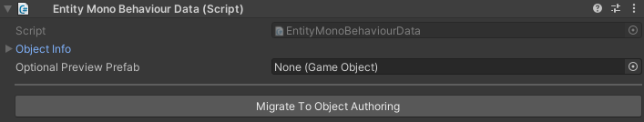

# Entity Mono Behaviour Data

## Migrate To Object Authoring [Button]
> This button takes the info in `EntityMonoBehaviourData.ObjectInfo` and transfers it into the
> `ObjectAuthoring`, `InventoryItemAuthoring`, and `PlaceableObjectAuthoring` Components.