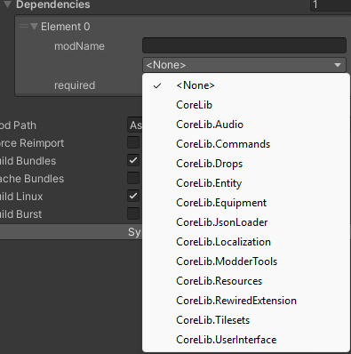
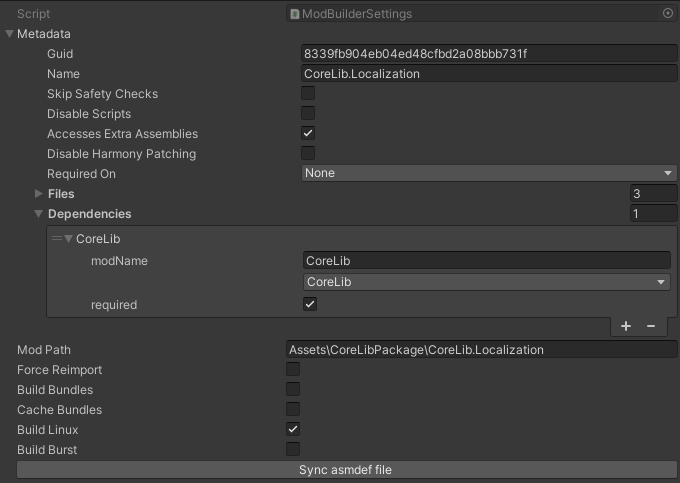

# Mod Builder Settings

## Dependencies Dropdown

> A dropdown has been added to the `Mod Builder Settings` asset for dependencies. You can now search and select via a combination of a string and dropdown.

## Sync Assembly Definition File

> The `Assembly Definition` asset **(.asmdef)** are able to be synced via a button on the `Mod Builder Settings` asset. It uses the `Mod Path` string to find the asset and update it with the dependencies automatically.
**Ignores any Unity or ModSDK assemblies.*

