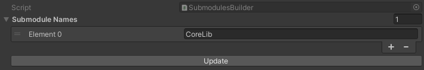

# Submodules Builder

> Asset Menu: `Create > CoreLib > Submodules Builder`

## Properties

<!-- tabs: start -->
<!-- tab: SubmodulesBuilder Class -->
| Name            | Type      | Display | Desc                                                     |
|:----------------|:----------|---------|----------------------------------------------------------|
| Submodule Names | string[ ] | List    | The list of `Mod Builder Setting` assets in your project |
<!-- tabs: end -->

## Update [Button]
> Searches for the `Mod Builder Settings` within the project and updates the name of each mod to the list.