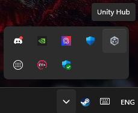
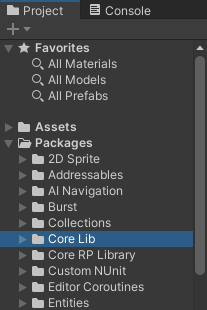

# How to Install

> To develop with CoreLib, you will need to install the Core Library Package into your mod SDK project.

## Preparation
The Core Library Package uses git packages, this means you **MUST** install [git](https://git-scm.com/download/win) and add it to your PATH environment variable.

[[Simple YouTube Video]](https://www.youtube.com/watch?v=s_ll71Q9CaI)

?> After installing git make sure to close `Unity` and `Unity Hub` ***COMPLETELY!***
Exit `Unity Hub` from the Windows Notification Area. ***Does not close on its own.***



## Installation

1. Use an Editor or File Explorer.
2. Navigate to your `<project root>` folder.
3. Open the `Packages` folder.
4. Open the `manifest.json` file.
5. Add following to the beginning to your dependencies.

<!-- tabs:start -->

<!-- tab:Line -->

<!-- select:start -->
<!-- select-menu-labels: Version Select -->

### Tag Version* <!-- select-option -->

?> Using the `Tag Version` is **\*Recommended** for stable usage. You will have to change the tag each time you want to update CoreLib.

Tag Version `#0.0.0`:
```json
"ck.modding.corelib": "https://github.com/CoreKeeperMods/CoreLib.git?path=/Assets/CoreLibPackage#3.6.4",
```
[List of CoreLib Tags](https://github.com/CoreKeeperMods/CoreLib/tags)

### Main Version <!-- select-option -->

?> Using the `Main Version` looks at the main branch on [GitHub](https://github.com/CoreKeeperMods/CoreLib/tree/main/).
As this is constantly worked on it could break at any point.
Use at your own risk.

Main Version `#main`:
```json
"ck.modding.corelib": "https://github.com/CoreKeeperMods/CoreLib.git?path=/Assets/CoreLibPackage#main",
```
<!-- select:end -->

<!-- tab:manifest.json -->

?> The `manifest.json` file should look like this.

```json
{
  "dependencies": {
    "ck.modding.corelib": "https://github.com/CoreKeeperMods/CoreLib.git?path=/Assets/CoreLibPackage#main",
    /* The rest of your dependencies */
  }
}
```
<!-- tabs:end -->

6. Save the `manifest.json` file.

## Done
After Unity is done installing you can now open your project, and you will have the CoreLib Package ready to be used.

