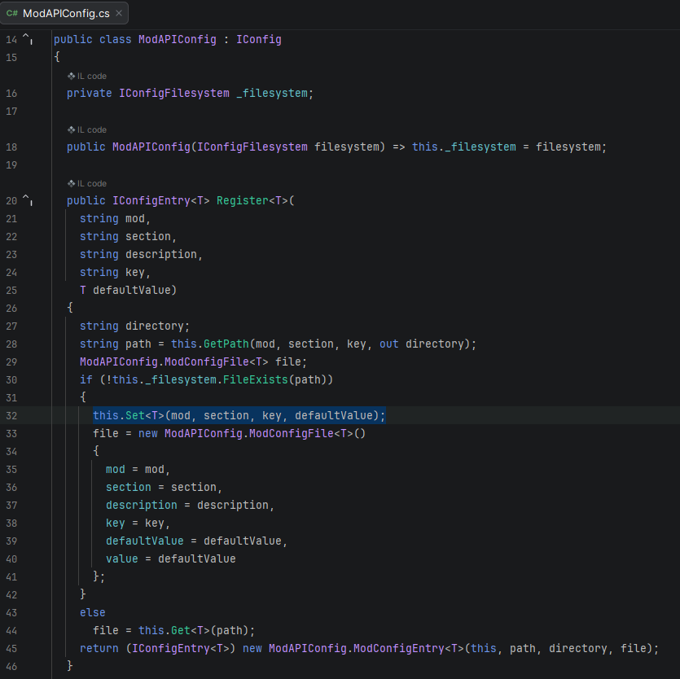

# API Config Register Bug

> When registering a new Config File, the Register function doesn't properly set the description or default value into the file.

<!-- tabs:start -->

<!-- tab:Bug -->

> Line 32 of `ModAPIConfig.cs` in `Pug.Other.dll` is causing this issue as the `Set<T>` method does **NOT** set the description or default values.



```json
{
    "mod": "DoubleMinecartSpeed",
    "section": "Multiplier",
    "description": "",
    "key": "MaxSpeed",
    "defaultValue": 0,
    "value": 2
}
```

<!-- tab:Work Around -->

> To work around this issue, simply grab the return config on register and set the value of that config to itself via the api.
> (Doesn't work if the file already existed before this implementation, the user would have to delete the folder to reset all config files)

```cs
var config = API.Config.Register(ModID, "Multiplier", "Multiplication Modifier for Minecart Max Speed.", "MaxSpeed", 2);
config.Value = API.Config.Get<int>(ModID, "Multiplier", "MaxSpeed");
```

```json
{
"mod": "DoubleMinecartSpeed",
"section": "Multiplier",
"description": "Multiplication Modifier for Minecart Max Speed.",
"key": "MaxSpeed",
"defaultValue": 2,
"value": 2
}
```

<!-- tabs:end -->
