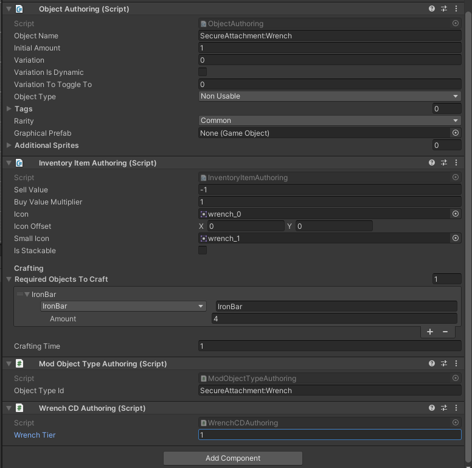

# Equipment Slot Submodule

> The Equipment Slot Submodule contains features to add/modify equipment slots more easily.

## Usage Example
Make sure to call `CoreLibMod.LoadSubmodule(typeof(EquipmentSlotModule));` to in your mod `EarlyInit()` function, before using the module. This will load the submodule.

## Adding Custom Slot
Then create a new class inheriting either from `EquipmentSlot` or `PlaceObjectSlot` classes. You can try to inherit other relevant classes. You also must implement an interface `IModEquipmentSlot`.

You also need to create a *logic* class. It must implement `IEquipmentLogic` and optionally `IPlacementLogic` if your slot is related to placing things. It is a separate class because while `EquipmentSlot` is a client sided class, the logic must be present on all sides. Additionally, their lifecycles do not overlap in a meaningful way

Please note that logic class MUST NEVER access data that outside of its context. The reason is that this code is being run as a part of an ECS system on both clients and server. The only exception can be static data such as configuration (Please note that configuration must be the same, or there will be issues in multiplayer)

### Slot Class
```csharp
public class WrenchEquipmentSlot : PlaceObjectSlot, IModEquipmentSlot
{
    // This string is a unique id of object type we are creating. 
    // It will be needed later when we create the item
    public const string WrenchObjectType = "SecureAttachment:Wrench";

    protected override EquipmentSlotType slotType => EquipmentModule.GetEquipmentSlotType<WrenchEquipmentSlot>();

    public ObjectType GetSlotObjectType() => EntityModule.GetObjectType(WrenchObjectType);

    // Please note that unlike in previous version we do NOT implement 'HandleInput' method. As it does not exist

    public void UpdateSlotVisuals(PlayerController controller)
    {
        ObjectDataCD objectDataCd = controller.GetHeldObject();
        ObjectInfo objectInfo = PugDatabase.GetObjectInfo(objectDataCd.objectID, objectDataCd.variation);

        controller.carryablePlaceItemSprite.gameObject.SetActive(true);

        Sprite iconOverride = Manager.ui.itemOverridesTable.GetIconOverride(controller.visuallyEquippedContainedObject.objectData, true);
        controller.carryablePlaceItemSprite.sprite = iconOverride != null ? iconOverride : objectInfo?.smallIcon;

        controller.carryablePlaceItemColorReplacer.UpdateColorReplacerFromObjectData(controller.visuallyEquippedContainedObject);
    }
}
```
### Logic Class
```csharp
public class WrenchSlotLogic : IEquipmentLogic, IPlacementLogic
{
    // These control some behaviour logic common to slots
    public bool CanUseWhileSitting => false;
    public bool CanUseWhileOnBoat => false;
    public bool CanResize => false;

    // In order to access custom components, create a lookup class
    private ComponentLookup<WrenchCD> wrenchCDLookup;

    private int placeableHash = Property.StringToHash("PlaceableObject/placeableObject");

    // This function will get called when the ECS system is being initialized before updates.
    // Here you can load the lookups and other things using system's state provided to you
    public void CreateLookups(ref SystemState state)
    {
        wrenchCDLookup = state.GetComponentLookup<WrenchCD>();
    }

    // This function is where all of the logic will happen
    // It will be executed every frame on every player that has your slot selected
    //
    // Included variables include the equipment aspect and some shared data.
    // From them you can access some components and other data, such as:
    // current tick, database bank, physics world, tile accessor, ecb, etc.
    public bool Update(
        EquipmentUpdateAspect aspect,
        EquipmentUpdateSharedData sharedData,
        LookupEquipmentUpdateData lookupData,
        bool interactHeld,
        bool secondInteractHeld,
        bool hasItemInMouse)
    {
        // Like this we can read some info about currently held item
        var objectData = aspect.equippedObjectCD.ValueRO.containedObject.objectData;
        ref var objectInfo = ref PugDatabase.GetEntityObjectInfo(objectData.objectID, sharedData.databaseBank.databaseBankBlob, objectData.variation);
            
        if (objectInfo.objectID == ObjectID.None || objectInfo.prefabEntities.Length <= 0) return false;
            
        var prefabEntity = objectInfo.prefabEntities[0];
        
        // Here we can check if our component is present
        if (!_wrenchLookup.HasComponent(prefabEntity)) return false;
        WrenchCD wrenchCd = _wrenchLookup[prefabEntity];
        
        // Now we update the placement position
        var nativeList = new NativeList<PlacementHandler.EntityAndInfoFromPlacement>(Allocator.Temp);
        PlacementHandler.UpdatePlaceablePosition(
            aspect.equippedObjectCD.ValueRO.equipmentPrefab,
            ref nativeList,
            aspect,
            sharedData,
            lookupData);
        nativeList.Dispose();

        // Check if user actually used the tool
        if (!secondInteractHeld) return false;

        // Fetch our data
        ref PlacementCD placement = ref equipmentAspect.placementCD.ValueRW;

        var pos = placement.bestPositionToPlaceAt;

        // And now do our logic
        // Return true if action has succeded.
        return false;
    }
    
    // This method is needed to implement 'IPlacementLogic'. 
    // It allows you to configure that logic that determines whether the slot can be activated
    // Due to the way this slot logic works, we want to always return 'true'. 
    // And to do that, we return total tile count, which is width * height
    public int CanPlaceObjectAtPosition( Entity placementPrefab, int3 posToPlaceAt, int width, int height, NativeHashMap<int3, bool> tilesChecked, ref NativeList<PlacementHandler.EntityAndInfoFromPlacement> diggableEntityAndInfos, in EquipmentUpdateAspect equipmentUpdateAspect, in EquipmentUpdateSharedData equipmentUpdateSharedData, in LookupEquipmentUpdateData equipmentUpdateLookupData)
    {
        return width * height;
    }
}
```

For more examples you can look at my recent `Secure attachment` mod. Portions of its code were used as demo code here.

Then you must register the slot. In mod's `EarlyInit()` function do this:

```cs
EquipmentModule.RegisterEquipmentSlot<WrenchEquipmentSlot>(WrenchEquipmentSlot.WrenchObjectType, EquipmentModule.PLACEMENT_PREFAB, new WrenchSlotLogic());
```

## Presets
You can either use one of the preset prefabs, or create your own prefab in Unity Editor. Reference other slot prefabs to do so.

Placement Prefab preset includes `PlacementHandler` and `PlaceIcon` (The blue square target), and is suitable if you are inheriting from `PlaceObjectSlot`.

## Item w/ Custom ObjectType
To use the equipment slot you must also add an item, which uses a custom ObjectType. To do so you must use `ModObjectTypeAuthoring` component. `objectTypeId` you must provide in it is the same as you have in your slot class. (the `WrenchObjectType` property in the example code)

### Example

<br>

## Resizeable slots
If you want your tool to be resizeable set `CanResize` property in your logic class to true. Additionally, your tool prefabs must have the following components: `ResizableTileSizeAuthoring` and `ModToolSizeAuthoring`. Second component allows you set max tool size

CoreLib will handle switching the size, and to get current size in your logic class do this:

```csharp
int2 toolSize = EquipmentSlot.GetTileSizeFromVariation(aspect.equipmentSlotCD.ValueRO, in aspect.placementSizeByEquipmentTypeBuffer, objectInfo.prefabTileSize); 
```

## Registering custom emotes
Equipment slot module also allows to register custom emotes to show to player (emote is a text appearing on screen in response to some action, like "My mining damage is too low")

In your `EarlyInit` do this:
```csharp
internal static Emote.EmoteType emoteMyMessage;

emoteMyMessage = EquipmentSlotModule.RegisterTextEmote($"{MOD_ID}:MyMessage");
```

Then in your `TextDataBlock` directory create folder called `Emotes` and text data block inside called `MOD_{MOD_ID}:MyMessage` with your localized message.

To spawn your emote call this method:

```csharp
EquipmentSlotModule.SpawnModEmoteText(position, emoteMyMessage);
```

By default, mod emotes replace previous ones spawned
