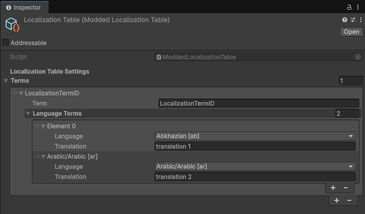

# Localization Submodule

> The Localization Submodule contains features to add/modify I2 localization strings more easily.

!> The Localization Submodule will eventually become obsolete when the Developers remove the Language Data Source System in place of the TextDataBlocks.

## Core Keeper Localization
Read through the [Core Keeper Localization](https://modding.corekeepergame.com/documentation/creating-mods/creating-a-mod/how-to-localize-your-mod) documentation before using this submodule.

## Usage
To load this submodule, add the following code to your `IMod` class within the `EarlyInit()` function.
<!-- tabs:start -->

<!-- tab:Copy Code -->
```csharp
CoreLibMod.LoadSubmodule(typeof(LocalizationModule));
```

<!-- tab:*MyMod.cs* Example -->
```csharp
using CoreLib;
using CoreLib.Submodule.Audio;
using PugMod;
using UnityEngine;

namespace MyNamespace
{
	public class MyMod : IMod
	{
		public void EarlyInit()
		{
            //Before the submodule is loaded
			CoreLibMod.LoadSubmodule(typeof(LocalizationModule));
            //The submodule is now loaded
		}
		
		public void Init() { }

		public void Shutdown() { }

		public void ModObjectLoaded(Object obj) { }

		public void Update() { }
	}
}
```

<!-- tabs:end -->

## Methods

- [`AddTerm[Dictionary]`](#addtermdictionary)
- [`AddTerm[string]`](#addtermstring)
- [`AddEntityLocalization[ObjectID]`](#addentitylocalizationobjectid)
- [`AddEntityLocalization[string]`](#addentitylocalizationstring)

### `AddTerm[Dictionary]`
> Adds a localization term to the localization table.

<!-- tabs:start -->
<!-- tab: Parameters -->
- **`term`** (`string`):
	- Description: The localization term ID to add.
- **`translations`** (`Dictionary<string,string>`):
	- Description: Dictionary containing the localization terms for each language.
<!-- tab: Examples -->
```csharp
LocalizationModule.AddTerm("TermID", new Dictionary<string, string> { { "en", "English Translation" }, { "zh-CN", "Chinese Translation" }, /*...*/ });
```
<!-- tabs:end -->

### `AddTerm[string]`
> Adds a localization term to the localization table.

<!-- tabs:start -->
<!-- tab: Parameters -->
- **`term`** (`string`):
	- Description: The localization term ID to add.
- **`en`** (`string`):
	- Description: The English translation of the term.
- **`cn`** (`string`) [_Optional_]:
	- Description: The Simplified Chinese translation of the term.
<!-- tab: Examples -->
```csharp
LocalizationModule.AddTerm("TermID", "English Translation", "Chinese Translation");
```
<!-- tabs:end -->

### `AddEntityLocalization[ObjectID]`
> Adds a localization term to the localization table for an entity.

<!-- tabs:start -->
<!-- tab: Parameters -->
- **`obj`** (`ObjectID`):
    - Description: The ObjectID of the Entity of which to add the localization term.
- **`enName`** (`string`):
    - Description: The name of the Entity in English.
- **`enDesc`** (`string`):
    - Description: The description of the Entity in English.
- **`cnName`** (`string`) [_Optional_]:
    - Description: The name of the Entity in Simplified Chinese.
- **`cnDesc`** (`string`) [_Optional_]:
    - Description: The description of the Entity in Simplified Chinese.
<!-- tab: Examples -->
```csharp
LocalizationModule.AddEntityLocalization(ObjectID.Wood, "English Name", "English Description", "Chinese Name", "Chinese Description");
```
<!-- tabs:end -->

### `AddEntityLocalization[string]`
> Adds a localization term to the localization table for an entity.

<!-- tabs:start -->
<!-- tab: Parameters -->
- **`objectName`** (`string`):
	- Description: The ObjectID of the Entity of which to add the localization term.
- **`enName`** (`string`):
	- Description: The name of the Entity in English.
- **`enDesc`** (`string`):
	- Description: The description of the Entity in English.
- **`cnName`** (`string`) [_Optional_]:
	- Description: The name of the Entity in Simplified Chinese.
- **`cnDesc`** (`string`) [_Optional_]:
	- Description: The description of the Entity in Simplified Chinese.
<!-- tab: Examples -->
```csharp
LocalizationModule.AddEntityLocalization("ModID:ItemID", "English Name", "English Description", "Chinese Name", "Chinese Description");
```
<!-- tabs:end -->


## Scriptable Objects

### `ModdedLocalizationTable`
> A Scriptable Object that contains a list of localization terms.



