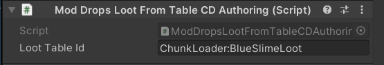

# Loot Drop Submodule

?> This documentation is a work in progress.

> The Loot Drop Submodule contains features to add/modify/remove loot drops from loot drop tables more easily.

## Usage Example
Make sure to call `CoreLibMod.LoadSubmodule(typeof(LootDropModule));` to in your mod `EarlyInit()` function, before using the module. This will load the submodule.


To modify existing drop table, in your plugin `EarlyInit()` method write:
```cs
// Add Iron Bar drop of amount 1 and weight 0.3 to Slime Blob loot
LootDropModule.AddNewDrop(LootTableID.SlimeBlobs, new DropTableInfo(ObjectID.IronBar, 1, 0.2f));

// Modify existing drop of Slime to 25 and weight 1 in Slime Blob loot
LootDropModule.EditDrop(LootTableID.SlimeBlobs, new DropTableInfo(ObjectID.Slime, 25, 1));

//Remove Scrap parts from Slime Blob loot
LootDropModule.RemoveDrop(LootTableID.SlimeBlobs, ObjectID.ScrapPart);
```
You can use string ids here to add modded items

You can find existing drops for each table by looking in your Unity project for a file named `LootTableBank`. There you can see every loot table with it's loot.

Adding custom loot tables is also really easy:
```cs
LootTableID lootTableID = LootDropModule.AddLootTable("MyAwesomeMod:MyCustomLootTable");
```
From here you can use normal `LootDropModule` methods to add any items to your drop table.

To easily make your entities drop your drop table add `ModDropsLootFromTableCDAuthoring` component. Then enter your drop table id into `lootTableId` field


