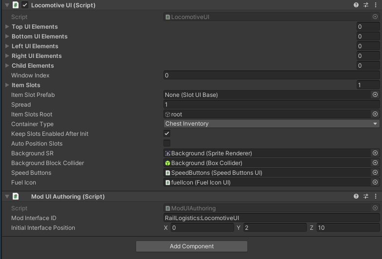
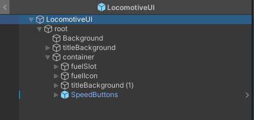

# User Interface Submodule

?> This documentation is a work in progress.

> The User Interface Submodule contains features to help add/modify user interfaces (UI) more easily.

!> This module is in pre-release stage, and the API might change in a non backwards compatible way or be extended if this is necessary.
**Use the module at your own risk.**

## Usage
To load this submodule, add the following code to your `IMod` class within the `EarlyInit()` function.
<!-- tabs:start -->

<!-- tab:Copy Code -->
```csharp
CoreLibMod.LoadSubmodule(typeof(UserInterfaceModule));
```

<!-- tab:*MyMod.cs* Example -->
```csharp
using CoreLib;
using CoreLib.Submodule.Audio;
using PugMod;
using UnityEngine;

namespace MyNamespace
{
	public class MyMod : IMod
	{
		public void EarlyInit()
		{
            //Before the submodule is loaded
			CoreLibMod.LoadSubmodule(typeof(UserInterfaceModule));
            //The submodule is now loaded
		}
		
		public void Init() { }

		public void Shutdown() { }

		public void ModObjectLoaded(Object obj) { }

		public void Update() { }
		}
	}
}
```

<!-- tabs:end -->

## Components

- [`LinkToPlayerInventory`](#linktoplayerinventory)
- [`ModUIAuthoring`](#moduiauthoring)
- [`PixelSnap`](#pixelsnap)

### `LinkToPlayerInventory`
This component is used to link a UI to the player inventory.

### `ModUIAuthoring`
This component is used to register a prefab as a UI for CoreLib.

### `PixelSnap`
This component is used to ensure UI elements are snapped to a pixel grid.

## Methods

- [`GetInteractionEntity`](#getinteractionentity)
- [`GetInteractionMonoBehaviour`](#getinteractionmonobehaviour)
- [`GetCurrentInterface`](#getcurrentinterface)
- [`GetModInterface`](#getmodinterface)
- [`OpenModUI`](#openmodui)
- [`OpenModUI[Entity]`](#openmoduientity)
- [`OpenModUI[EntityMonoBehaviour]`](#openmoduientitymonobehaviour)
- [`RegisterModUI`](#registermodui)
- [`IsVisible`](#isvisible)

### `GetInteractionEntity`
> Returns the Interaction Entity for the specified entity.

<!-- tabs:start -->
<!-- tab:Returns -->
- **`T`** (`Entity`):
	- Description: The current Interaction Entity.
<!-- tab:Example -->
```csharp
var currEntity = UserInterfaceModule.GetInteractionEntity();
```
<!-- tabs:end -->


### `GetInteractionMonoBehaviour`
> Returns the Interaction Monobehaviour for the specified entity.

<!-- tabs:start -->
<!-- tab:Returns -->
- **`T`** (`EntityMonoBehaviour`):
	- Description: The current Interaction Monobehaviour.
<!-- tab:Example -->
```csharp
var currMono = UserInterfaceModule.GetInteractionMonoBehaviour();
```
<!-- tabs:end -->

### `GetCurrentInterface`
> Returns the currently visible UI.

<!-- tabs:start -->
<!-- tab:Parameters -->
- **`T`** (`IModUI`) [_Type Parameter_]:
	- Description: The UI to check.
<!-- tab:Returns -->
- **`T`** (`IModUI`):
	- Description: The currently visible UI.
<!-- tab:Example -->
```csharp
var customUI = UserInterfaceModule.GetCurrentInterface<MyCustomUI>();
```
<!-- tabs:end -->

### `GetModInterface`
> Returns the UI for the specified ID.

<!-- tabs:start -->
<!-- tab:Parameters -->
- **`T`** (`IModUI`) [_Type Parameter_]:
	- Description: The UI to check.
- **`interfaceID`** (`string`):
    - Description: The string ID of the UI.
<!-- tab:Returns -->
- **`T`** (`IModUI`):
	- Description: The UI for the specified ID.
<!-- tab:Example -->
```csharp
LocomotiveUI locomotiveUI = UserInterfaceModule.GetModInterface<LocomotiveUI>("RailLogistics:LocomotiveUI");
```
<!-- tabs:end -->

### `OpenModUI`
> Opens a UI for the specified ID.

<!-- tabs:start -->
<!-- tab:Parameters -->
- **`interfaceID`** (`string`):
	- Description: The string ID of the UI.
<!-- tab:Example -->
```csharp
UserInterfaceModule.OpenModUI("MyMod:MyCustomUI");
```
<!-- tabs:end -->

### `OpenModUI[Entity]`
> Opens a UI for the specified entity.

<!-- tabs:start -->
<!-- tab:Parameters -->
- **`openEntity`** (`Entity`):
	- Description: The Entity opening the UI.
- **`interfaceID`** (`string`):
	- Description: The string ID of the UI.
<!-- tab:Example -->
```csharp
UserInterfaceModule.OpenModUI(this, "MyMod:MyCustomUI");
```
<!-- tabs:end -->

### `OpenModUI[EntityMonoBehaviour]`
> Opens a UI for the specified entity.

<!-- tabs:start -->
<!-- tab:Parameters -->
- **`openBehaviour`** (`EntityMonoBehaviour`):
	- Description: The EntityMonoBehaviour opening the UI.
- **`interfaceID`** (`string`):
	- Description: The string ID of the UI.
<!-- tab:Example -->
```csharp
UserInterfaceModule.OpenModUI(this, "MyMod:MyCustomUI");
```
<!-- tabs:end -->

### `RegisterModUI`
> Registers a prefab as a UI.

<!-- tabs:start -->
<!-- tab:Parameters -->
- **`go`** (`GameObject`):
	- Description: The prefab to register.
<!-- tab:Example -->
```csharp
UserInterfaceModule.RegisterModUI(gameObject);
```
<!-- tabs:end -->

### `IsVisible`
> Returns true if the UI is currently visible.

<!-- tabs:start -->
<!-- tab:Parameters -->
- **`T`** (`IModUI`) [_Type Parameter_]:
	- Description: The UI to check.
- **`modInterface`** (`IModUI`) [_this_]:
	- Description: The UI to check.
<!-- tab:Example -->
```csharp
LocomotiveUI locomotiveUI;
var isVisible = locomotiveUI.IsVisible<LocomotiveUI>();
```
<!-- tabs:end -->

## Create Prefab
Create a new prefab and add the following components.
1. Your custom `UIElement` extended class with an additional extension of the interface `IModUI`.
	- Inspect vanilla interfaces for examples (They can be found under the class `UIManager`)
2. A `ModUIAuthoring` component.
    - This component is used to register the prefab as a UI.
    - The naming convention for Mod Interface ID is `MyMod:MyCustomUI`.
3. (Optional) A `LinkToPlayerInventory` component.
	- Only required if the UI requires the player inventory to be present.

```csharp
public class MyCustomUI : UIElement, IModUI { }
```
```csharp
public class MyCustomUI2 : InventoryUI, IModUI { }
```
```csharp
public class MyCustomUI3 : CharacterWindowUI, IModUI { }
```

<br>

Then create a game object called `root`, and place all UI elements under it.

<br>

You can use a component called `PixelSnap` to ensure your UI elements have been snapped to pixel grid to prevent rendering artifacts. In general remember that your UI sprites should be using Pixels Per Unit of 16 and be snapped to 1/16 grid.

## Register The Prefab

Now in your mod `ModObjectLoaded(Object obj)` method write:
<!-- tabs:start -->
<!-- tab:Default -->
```cs
if (obj is not GameObject gameObject) return;
UserInterfaceModule.RegisterModUI(gameObject);
```
<!-- tab:Alternative -->
```cs
if (obj is LocomotiveUI locomotiveUI)
	UserInterfaceModule.RegisterModUI(locomotiveUI);
```
<!-- tabs:end -->

## Opening The UI

To open the UI, use methods conveniently provided by the Graphical Entity's class:

**Example:** The `Locomotive` Graphical Entity has a `Use()` method that opens the `LocomotiveUI`.

<!-- tabs:start -->
<!-- tab:EntityMonoBehaviour Class -->
```cs
// This method must also be set in the InteractableObject component of the EntityMonoBehaviour component.
public void OnUse()
{
    // I recommend to make a constant for the ID value
    ModUIManager.OpenModUI(this, "RailLogistics:LocomotiveUI");
}
```
<!-- tab:Entity Class -->
?> Note that the `GetInteractionMonoBehaviour()` method will not be available when opening the UI this way.
```cs
ModUIManager.OpenModUI(myEntity, "MyMod:AmazingUI");
```
<!-- tab:Any Class -->
?> Note that the `GetInteractionEntity()` and `GetInteractionMonoBehaviour()` methods will not be available when opening the UI this way.
```cs
ModUIManager.OpenModUI("MyMod:AmazingUI");
```
<!-- tabs:end -->